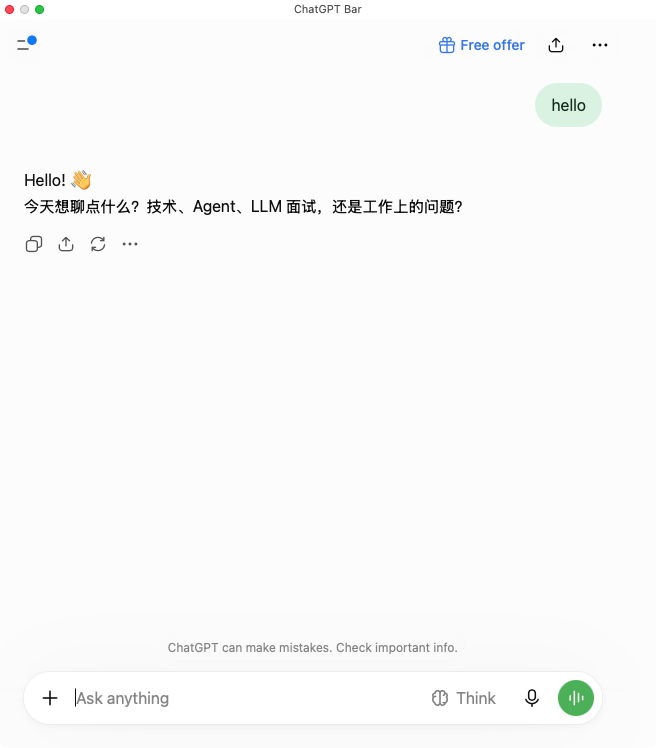
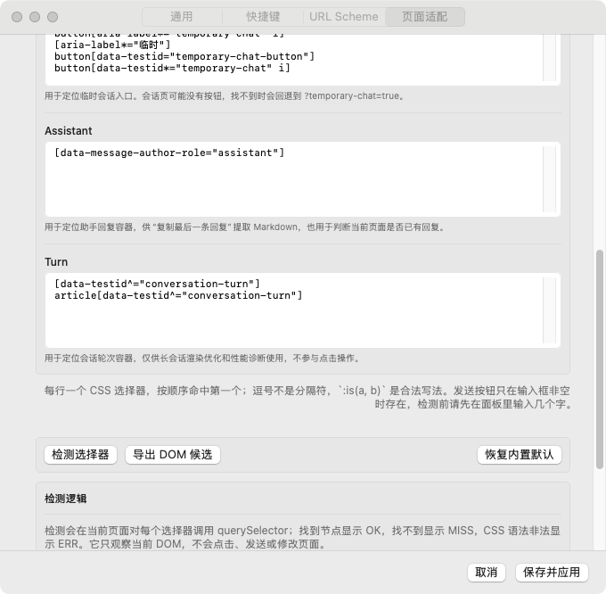

# ChatGPT Bar

[English](README.md) | [简体中文](README.zh-CN.md)

A native-feeling macOS menu bar shell for ChatGPT, built with Swift/AppKit and `WKWebView`.

ChatGPT Bar keeps ChatGPT available as a persistent, pinnable macOS panel with global shortcuts, URL Scheme automation, macOS Services, configurable page selectors, diagnostics, and local-only settings.





## Features

- **Menu bar app**: left-click to show/hide the panel; right-click for the menu.
- **Global shortcut**: `⌥⌘Space` by default for show/hide.
- **Panel shortcuts**: `⌘P` Pin, `⌘N` New Chat, `⌘⇧N` New Temp Chat, and `⌘⇧C` Copy Last Response by default.
- **Pin support**: uses macOS `.floating` window level and persists the state.
- **Configurable response copy**: use `getLastResponse` Markdown by default, or trigger ChatGPT's native Copy button and observe the system pasteboard.
- **URL Scheme**: supports `open`, `newChat`, `newTempChat`, `copyLastResponse`, and `paste`; commands can be enabled individually.
- **macOS Services**: send selected text to ChatGPT.
- **Paste modes**: `append`, `replace`, and `send`, with confirmation before automatic submission.
- **Page adaptation**: configurable selectors, selector probing, DOM candidate export, and built-in selector reset.
- **Visible failures**: selector misses, shortcut conflicts, bridge failures, and disabled URL commands are reported.
- **Proxy**: uses `WKWebsiteDataStore.proxyConfigurations` on macOS 14+.
- **Local-first**: no telemetry; login state and settings remain on your Mac.

## Requirements

- macOS 13 Ventura or later
- Apple Silicon or Intel Mac

## Install

Download the matching archive from [Releases](../../releases/latest):

| Mac | Artifact |
| --- | --- |
| Apple Silicon | `ChatGPTBar-macos-arm64-v<version>.zip` |
| Intel | `ChatGPTBar-macos-x86_64-v<version>.zip` |

Each release also includes source archives and a `SHA256SUMS.txt` file.

The app is ad-hoc signed and is not notarized. If macOS blocks the first launch, run:

```sh
xattr -dr com.apple.quarantine "ChatGPT Bar.app"
```

Build from source:

```sh
sh scripts/build.sh
open "dist/ChatGPT Bar.app"
```

## Shortcuts

| Action | Default | Scope |
| --- | ---: | --- |
| Show / hide panel | `⌥⌘Space` | Global |
| Pin / Unpin | `⌘P` | Panel focused |
| New Chat | `⌘N` | Panel focused |
| New Temp Chat | `⌘⇧N` | Panel focused |
| Copy Last Response | `⌘⇧C` | Panel focused |

Shortcuts can be changed in **Settings → Shortcuts**. Panel-local shortcuts only fire while the chat panel is the key window, so they do not intercept typing in the Settings window or on the page.

## Copy behavior

`Copy Last Response` has two explicit strategies in **Settings → General →
Copy**:

- **Markdown (`getLastResponse`)** reads the latest assistant container through
  the page bridge, rebuilds Markdown from the rendered DOM, and writes it to the
  native macOS pasteboard.
- **ChatGPT native Copy** triggers the latest response's own Copy button and
  waits for the native pasteboard to change. It does not wrap or intercept
  `navigator.clipboard`, so the page keeps its original behavior.

The `getLastResponse` bridge operation always returns a `markdown` field. The
native Copy strategy is intentionally separate because ChatGPT's own action may
produce plain text rather than Markdown, and synthetic clicks do not always have
the same user-activation privileges as a real click.

## URL Scheme

Commands are sent through `chatgptbar://` and can be enabled or disabled in **Settings → URL Scheme**.

| Command | Example |
| --- | --- |
| `open` | `chatgptbar://open` |
| `newChat` | `chatgptbar://newChat` |
| `newTempChat` | `chatgptbar://newTempChat` |
| `copyLastResponse` | `chatgptbar://copyLastResponse` |
| `paste` | `chatgptbar://paste?text=hello&mode=append&send=0` |

`paste` accepts:

- `mode=append|replace`
- `send=0|1`
- `reveal=0|1`

`send=1` shows a confirmation by default because any local process can open a URL Scheme. Automatic confirmation can be enabled explicitly in Settings.

## Pin semantics

Pin uses macOS `.floating` window level: above normal windows and generally visible across Spaces. It is not an absolute system overlay level; system security prompts, menus, and some exclusive full-screen windows can still appear above it.

The app re-applies ordering when the panel is shown, pinned, focused, or unfocused because AppKit may reorder non-activating panels.

## Diagnostics

Run the executable inside the app bundle for development flags:

```sh
BIN="dist/ChatGPT Bar.app/Contents/MacOS/ChatGPTBar"

"$BIN" --settings [general|shortcuts|urlScheme|page]
"$BIN" --url "https://chatgpt.com/c/<id>"
"$BIN" --dev-report /tmp/report.json --settle 10 --ab --exit-after-report
"$BIN" --dev-report /tmp/report.json --probe-composer
"$BIN" --force-optimization 0|1
```

Reports include document commit time, first-turn and stable-content timing,
conversation scroller dimensions, resource counts, optional Long Tasks data,
scroll sampling support, and selector results. A hidden WebView reports
`jank.supported=false` instead of treating missing animation frames as zero
jank.

When long-conversation rendering optimization is disabled, saving selector
changes updates the current bridge without reloading the page. Changing the
rendering optimization still reloads because it depends on document-start CSS.

Run the local WebKit smoke test after building:

```sh
scripts/test-webkit-diagnostics.sh
```

## Development

```sh
swift build
swift run SelfTest
sh scripts/build.sh
sh scripts/test-all.sh

# Build a specific architecture
ARCHS=x86_64 sh scripts/build.sh

# Build both architectures where supported
ARCHS="arm64 x86_64" sh scripts/build.sh
```

`SelfTest` is a SwiftPM executable so pure logic can be tested even on machines with only Command Line Tools. Window ordering, multi-display, full-screen, and live ChatGPT behavior still require manual testing.

### Project layout

```text
.
├── Package.swift
├── Sources/
│   ├── ChatGPTBarKit/          # Pure logic: settings, shortcuts, selectors, bridge
│   ├── ChatGPTBar/             # AppKit + WebKit integration and UI
│   └── SelfTest/               # Pure-logic checks
├── Support/Info.plist
├── Resources/
├── scripts/build.sh
└── docs/images/
```

## Releases

1. Update `CFBundleShortVersionString` in `Support/Info.plist`.
2. Update `CHANGELOG.md`.
3. Merge to `main`.

The Release workflow detects an unpublished version, creates the tag, runs self-tests, builds separate `arm64` and `x86_64` apps, creates source archives, and uploads all artifacts.

Manual triggers can specify a version, with or without the `v` prefix.

## Signing and notarization

Current release artifacts are ad-hoc signed. They are safe to build locally but macOS may quarantine downloads. Public distribution is smoother with:

1. Apple Developer Program membership.
2. A `Developer ID Application` certificate.
3. Hardened Runtime enabled at signing time.
4. Notarization with `notarytool`, followed by `stapler staple`.

CI needs repository secrets for the certificate, certificate password, Apple ID or App Store Connect API key, and Apple Team ID. Signing credentials are intentionally not stored in this repository.

## Privacy and security

- No telemetry.
- No content proxying unless a proxy is configured.
- ChatGPT cookies and site data remain in the app's local website data store.
- URL commands are individually disableable, and auto-send is opt-in.

## Known limitations

- Page selectors depend on ChatGPT's DOM and may need recalibration after site changes.
- The DOM fallback cannot perfectly reconstruct every custom card, table, or complex component.
- Releases are ad-hoc signed and not notarized.
- OAuth popups, microphone permission, and the macOS 14+ proxy path need broader manual testing.

## Contributing

Read [CONTRIBUTING.md](CONTRIBUTING.md) before opening an issue or pull request. For security issues, see [SECURITY.md](SECURITY.md).

## License

[MIT](LICENSE)
